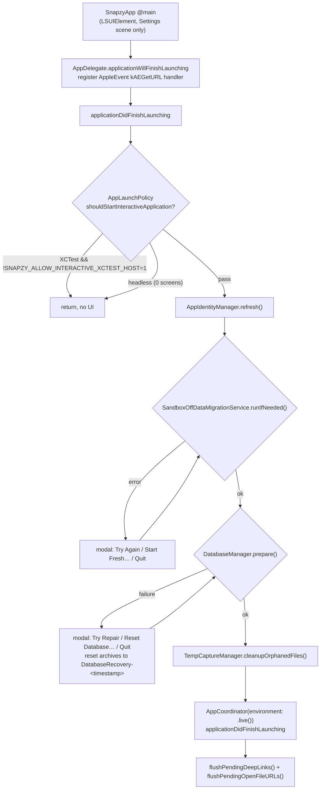

# App Lifecycle

How Snapzy launches, runs onboarding, lives in the menu bar, and shuts down. Covers `Snapzy/App/`, splash/onboarding, app identity, theme, data migrations, and the entitlements/Info.plist contract.

Current as of HEAD (`v1.30.0-beta.15`, build 151, macOS 13.0+ deployment target).

## Platform shape

- Menu-bar-only app: `INFOPLIST_KEY_LSUIElement = YES` (build setting in `Snapzy.xcodeproj/project.pbxproj`), no Dock icon by default.
- `@main` entry: `SnapzyApp` in `Snapzy/App/SnapzyApp.swift` — declares only a `Settings` scene hosting `PreferencesView`, tinted by `ThemeManager.shared.systemAppearance`. All other windows are AppKit-driven.
- `SnapzyApp.init()` calls `AppIdentityManager.shared.refresh()` before anything else.
- Bundle IDs: `com.trongduong.snapzy` (release), `com.trongduong.snapzy.debug` (debug) — see `AppBundleIdentity` in `Snapzy/Services/AppIdentity/AppIdentityManager.swift`.
- Not sandboxed: `ENABLE_APP_SANDBOX = NO` and `Snapzy/Snapzy.entitlements` contains no `com.apple.security.app-sandbox` key. Hardened runtime is enabled. The declared entitlements still matter for specific subsystems (see below).

## Launch sequence

- `AppLaunchPolicy` (`Snapzy/App/SnapzyApp.swift`): skips interactive startup under XCTest unless `SNAPZY_ALLOW_INTERACTIVE_XCTEST_HOST=1`, and in headless sessions (`NSScreen.screens.count == 0`).
- Sandbox-off migration failure loops a critical modal: **Try Again** (retry), **Start Fresh…** (confirm, then `skipMigration()`; old sandbox data is left untouched), **Quit Snapzy**.
- Database failure loops: **Try Repair** (`DatabaseManager.attemptRepair()`), **Reset Database…** (moves files into `DatabaseRecovery-<timestamp>` then `retryInitialization()`), **Quit Snapzy**.
- AppleEvents arriving before the coordinator exists are queued in `pendingDeepLinkURLs` and flushed after launch; same for cold-launch "Open With" file URLs (`pendingOpenFileURLs`).
- `applicationShouldHandleReopen`: when the menu bar icon is hidden (`showMenuBarIcon == false`) and no windows are visible, opens Preferences (General tab) and suppresses default reopen.
- `application(_:open:)`: file URLs routed to `AnnotateManager.shared.openAnnotation(url:)` (Finder "Open With" / Dock drop); non-file URLs ignored here (deep links flow through the AppleEvent handler).
- `applicationWillTerminate`: removes the AppleEvent handler, forwards to `AppCoordinator.applicationWillTerminate()`.

## AppCoordinator duties

`Snapzy/App/AppCoordinator.swift` — `applicationDidFinishLaunching()` performs, in order:

1. `AppIdentityManager.shared.refresh()`.
2. `CrashSentinel.shared.checkAndReset()` → `didCrash` flag.
3. `DiagnosticLogger.shared.startSession()` + launch log with `previousCrash` context.
4. `LegacyLicenseCleanupService.shared.runIfNeeded()`.
5. UserDefaults defaults seeding (only when key absent):

   | Key | Seeded value |
   | --- | --- |
   | `diagnostics.retentionDays` | 3 (`LogCleanupScheduler.defaultRetentionDays`) |
   | `urlSchemeEnabled` | `true` |
   | `history.enabled` | `true` |
   | `history.retentionDays` | 30 |
   | `history.maxCount` | 500 |
   | `history.openOnLaunch` | `false` |
   | `history.floating.enabled` | `true` |
   | `history.floating.position` | `"topCenter"` |
   | `history.floating.maxDisplayedItems` | 10 |

6. TOML configuration: `SnapzyConfigurationAutoImporter.applyIfNeededOnLaunch()` → `SnapzyConfigurationSyncCoordinator.start()`; when the auto-import did not apply, `scheduleSync(reason: .appLaunch)`.
7. Schedulers: `LogCleanupScheduler`, `RecordingMetadataCleanupScheduler`, `CaptureHistoryRetentionService` — all `.start()`.
8. `AppStatusBarController.shared.setup(viewModel:updater:didCrash:)` — `didCrash` prompt only when crash detected **and** `DiagnosticLogger.isEnabled`; also pre-allocates the area-selection window pool via `AreaSelectionController.shared.prepareWindowPool()` (targets <150 ms activation).
9. After 0.3 s: `presentStartupExperience(...)` (see Onboarding).
10. `.showOnboarding` notification observer → `SplashWindowController.shared.show(forceOnboarding: true)` ("Restart Onboarding" path).

Termination (`applicationWillTerminate`): `SnapzyConfigurationSyncCoordinator.flushPendingSync(reason: .appTerminate)`, `CrashSentinel.markTerminated()`, stop `LogCleanupScheduler` / `RecordingMetadataCleanupScheduler` / sync coordinator, remove observers.

Deep links: `handleDeepLink(_:)` constructs `SnapzyDeepLinkHandler` and dispatches — see [SHORTCUTS.md](SHORTCUTS.md) for the route table.

## Onboarding & splash

Unified flow: `SplashWindowController` (`Snapzy/Features/Splash/SplashWindow.swift`) hosts `SplashOnboardingRootView` (`Snapzy/Features/Splash/SplashOnboardingRootView.swift`) in a `SplashWindow` (~85% of visible screen, max 1200×800, min 700×500, transparent titlebar, fades in/out).

State machine (`SplashScreen`): `splash` → `language` → `sponsor` (only when `sponsorPromptSeen` is false) → `permissions` → `configAccess` → `shortcuts` → `diagnostics` → `completion`. Default onboarding steps: `[language, permissions, configAccess, shortcuts, diagnostics, completion]`.

- `hasCompletedOnboarding` = UserDefaults `onboardingCompleted` (`OnboardingFlowView` in `Snapzy/Features/Onboarding/OnboardingFlowView.swift`).
- Permissions step (`Snapzy/Features/Onboarding/Components/OnboardingPermissionsView.swift`): screen recording / microphone / accessibility rows.
- `configAccess` step: grant folder access for `~/.config/snapzy` (holds `config.toml`; see `SnapzyConfigurationPaths` in `Snapzy/Services/Configuration/`).
- Shortcuts step: Accept calls `KeyboardShortcutManager.shared.enable()`; Decline just advances.
- Diagnostics step: toggle for `diagnostics.enabled` (default on).
- Completion sets `onboardingCompleted` + `sponsorPromptSeen`.
- Skip logic in `SplashWindowController.showWindow`:
  - `splashSkipped` → skip splash entirely when onboarding done and sponsor seen.
  - `splash.skipOnceAfterOnboardingRelaunch` → one-time skip after a language-change relaunch, then the key is removed.
- Language preview: `OnboardingLocalizationController` (`Snapzy/Features/Onboarding/Managers/`) re-renders onboarding strings in the selected language without relaunch; on completion `commitLanguageSelection()` persists via `AppLanguageManager` and, when `requiresRelaunchOnCompletion`, calls `relaunchApplication()` after setting the skip-once key.
- Startup gating (`AppCoordinator.presentStartupExperience`): for existing users (`hasCompletedOnboarding`), when TOML auto-import returns `.skippedPermissionRequired` and `configuration.accessOnboardingPrompted` is false, show a one-time configAccess-only step (`showConfigurationAccess()`, steps `[.configAccess]`) instead of the splash. Otherwise `SplashWindowController.show()`, then after 1.5 s remove the legacy `hasSeenSmartElementIntro` key and present any pending `FeatureIntroManager` campaign.
- "Restart Onboarding" (Preferences → General → Help): `OnboardingFlowView.resetOnboarding()` clears `onboardingCompleted` / `splashSkipped` / skip-once key, posts `.showOnboarding`.

## Menu bar

`AppStatusBarController` (`Snapzy/App/AppStatusBarController.swift`) — singleton owning the `NSStatusItem` (variable length, template `MenubarIcon` rescaled to 18 pt).

- Click behavior: button `sendAction(on: [.leftMouseUp, .rightMouseUp])` — both left and right click rebuild and open the same menu (`buildMenu()` runs on every open to refresh state).
- Menu structure (verified in `buildMenu()`):
  - When recording/paused: **Stop Recording (mm:ss)** and **Pause/Resume Recording**, then separator.
  - Captures: Capture Area, Capture Area & Annotate, Application Capture (overlay shortcut), Capture Fullscreen, Capture Active Window, Scrolling Capture (disabled while a session is active), Capture Text (OCR), Capture Smart Element, Object Cutout (macOS 14+ only).
  - Recording: Record Screen, Application Recording (both disabled while recorder active).
  - Tools: Open Annotate, Edit Video, Cloud Uploads (enabled only when `CloudManager.shared.isConfigured`), History, Keyboard Shortcuts.
  - Conditional: **Grant Permission** (when screen permission missing), **What's New** (pending `FeatureIntroManager` campaign).
  - Check for Updates, Preferences `⌘,`, Quit `⌘Q`.
  - Configured shortcut key equivalents are attached to menu items via `applyConfiguredShortcut(_:for:using:)`; overlay shortcuts (Application Capture/Recording) render as child-key suffixes (see [SHORTCUTS.md](SHORTCUTS.md)).
- Recording state rendering: while recording, the title shows a monospaced-digit timer (`recorder.formattedDuration`); when paused it is prefixed with `|| `; tooltip mirrors state. `setProcessing(_:)` swaps the icon for an `NSProgressIndicator` spinner (used e.g. during OCR) on Core Animation so it keeps animating.
- Visibility: `showMenuBarIcon` pref toggles the status item (`syncStatusItemVisibility`).
- Preferences activation-policy dance (`presentPreferencesWindow`): elevates `.accessory` → `.regular` so Snapzy appears in the app menu/Cmd+Tab, triggers the Settings scene (synthesized `⌘,` key equivalent on macOS 14+, `showSettingsWindow:` before), tracks the window (12 retry passes), and reverts to `.accessory` in `windowDidClose` when no other normal windows remain. While recording, the tracked Preferences window is added to the recorder's runtime exclusion list so Snapzy's own window isn't captured.

Known leftover: `reportProblemAction` (calls `CrashReportService.presentAlert()`) and the stored `didDetectCrash` flag exist, but **no menu item is wired to them** in `buildMenu()` — problem reporting currently lives in Preferences → About (and Preferences → General → Help). See [UPDATES.md](UPDATES.md).

## App identity

`AppIdentityManager` (`Snapzy/Services/AppIdentity/AppIdentityManager.swift`) evaluates `AppIdentityHealth` at launch and on refresh:

- `unexpectedBundleIdentifier` — bundle ID ≠ expected (`com.trongduong.snapzy` / `.debug`).
- `invalidBundleSignature` — strict `SecStaticCode` validation (release builds only; debug skips since Xcode ad-hoc signing fails `kSecCSStrictValidate`).
- `outsideApplications` + `quarantined` — only flagged together when the app has the quarantine xattr **and** runs outside `/Applications` and `~/Applications`. Quarantine inside Applications folders is intentionally ignored (Homebrew Cask upgrades preserve the xattr; Gatekeeper clears it on first launch — issue #337).

The Permissions tab reflects unhealthy identity as `grantedButUnavailableDueToAppIdentity`.

## Theme

- `ThemeManager` (`Snapzy/Services/Appearance/ThemeManager.swift`): `@AppStorage(PreferencesKeys.appearanceMode)` → `AppearanceMode` `.system` / `.light` / `.dark`.
- `nsAppearance`: `nil` (system) / `.aqua` / `.darkAqua` for AppKit windows; `systemAppearance: ColorScheme` published for SwiftUI `.preferredColorScheme`, tracking `AppleInterfaceThemeChangedNotification`.
- `WindowSurfacePalette`: shared opaque window backgrounds (`lightBase` white 0.95, `darkBase` white 0.12).

## Migrations & recovery

- Sandbox-off data migration: `SandboxOffDataMigrationService` (`Snapzy/Services/Migration/`) — one-time move of App Support items, preferences, and logs out of the old sandbox container for upgrades to unsandboxed builds. Skips when running sandboxed (`APP_SANDBOX_CONTAINER_ID` present) or already done. Completion tracked by marker file `.sandbox-off-migration-completed` and UserDefaults `migration.sandboxOff.completed`. Launch-blocking modal on failure (see flowchart).
- Legacy license cleanup: `LegacyLicenseCleanupService` (`Snapzy/Services/LegacyLicenseCleanupService.swift`), completion key `legacyLicenseCleanupCompleted`.
- Database recovery: `DatabaseManager` (`Snapzy/Services/Cloud/DatabaseManager.swift`) prepares `snapzy.db`; reset archives old files to `DatabaseRecovery-<timestamp>` (capture files on disk and cloud objects are never deleted).
- Legacy key cleanup: `hasSeenSmartElementIntro` removed at launch (replaced by `FeatureIntroManager` campaigns).

## Entitlements & Info.plist

`Snapzy/Snapzy.entitlements` (no app-sandbox key — builds are **not** sandboxed):

- `com.apple.security.network.client` — outbound network (cloud uploads, updates, OAuth). No `network.server` entitlement is declared.
- `com.apple.security.files.user-selected.read-write` — user-picked files/folders.
- `com.apple.security.device.audio-input` — microphone for recordings.
- `com.apple.security.temporary-exception.shared-preference.read-only` → `com.apple.symbolichotkeys` — system screenshot shortcut conflict detection (see [SHORTCUTS.md](SHORTCUTS.md)).
- `com.apple.security.temporary-exception.mach-lookup.global-name` → `$(PRODUCT_BUNDLE_IDENTIFIER)-spks` / `-spki` — Sparkle installer launcher service (paired with `SUEnableInstallerLauncherService`).

`Snapzy/Resources/Info.plist`:

- `CFBundleURLTypes`: `snapzy://` scheme (deep links — see [SHORTCUTS.md](SHORTCUTS.md)).
- `CFBundleDocumentTypes`: Editor role (rank `Alternate`) for `public.png`, `public.jpeg`, `public.heic`, `public.heif`, `public.tiff`, `com.compuserve.gif`, `org.webmproject.webp`, `public.bmp` — routes "Open With" into the Annotate editor.
- `NSMicrophoneUsageDescription`, `NSScreenCaptureUsageDescription`.
- Sparkle keys: `SUFeedURL`, `SUPublicEDKey`, `SUEnableInstallerLauncherService` — see [UPDATES.md](UPDATES.md).

Security-scoped bookmarks persisted in UserDefaults: `exportLocation.bookmark` (save folder), `configuration.fileBookmark` / `configuration.directoryBookmark` (TOML config), `wallpaper.directoryBookmark` / `wallpaper.customBookmarks`.

## Deep link dispatch

AppleEvent `kAEGetURL` → `AppDelegate.handleGetURLEvent` → queued until coordinator ready → `AppCoordinator.handleDeepLink` → `SnapzyDeepLinkHandler.handle(url)`. Gated by `urlSchemeEnabled` (default `true`); unknown routes are logged and ignored. Full route table: [SHORTCUTS.md](SHORTCUTS.md#url-scheme-automation).

## Unresolved questions

- `reportProblemAction` / `didDetectCrash` in `AppStatusBarController` are stored but never wired into the menu — dead code or pending feature? Currently problem reporting is only reachable via Preferences (see [UPDATES.md](UPDATES.md)).

## Related docs

- [SHORTCUTS.md](SHORTCUTS.md) — hotkeys + `snapzy://` route table
- [PREFERENCES.md](PREFERENCES.md) — Settings window reference
- [UPDATES.md](UPDATES.md) — Sparkle, diagnostics, crash/problem reporting
- [CONFIGURATION.md](CONFIGURATION.md) — TOML config file, `~/.config/snapzy` grant
- [STRUCTURE.md](STRUCTURE.md) — project layout
- [DEVELOPMENT.md](DEVELOPMENT.md) — local development setup
