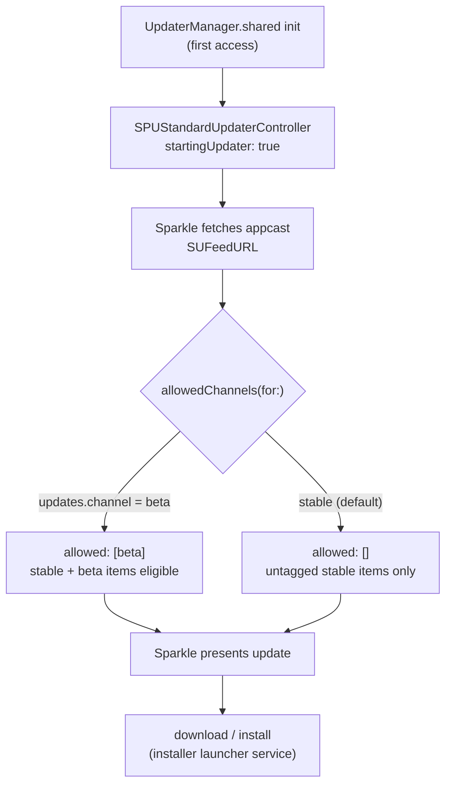
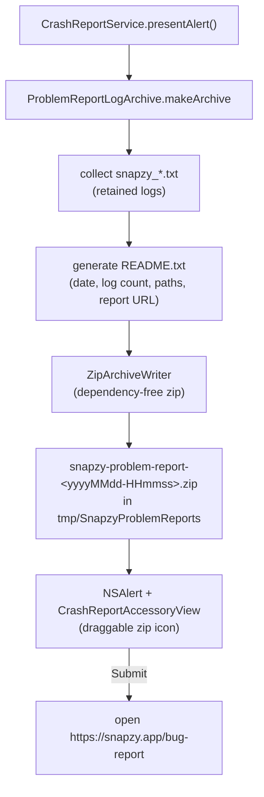

# Updates, Diagnostics & Problem Reporting

Sparkle-based app updates, local diagnostic logging, crash detection, and the manual problem-report bundle. No telemetry anywhere — logs stay on the user's Mac.

Verified against `Snapzy/Services/Updates/UpdaterManager.swift`, `Snapzy/Features/Updates/`, `Snapzy/Services/Diagnostics/`, `Snapzy/Features/CrashReport/`, `Snapzy/Resources/Info.plist`, and `appcast.xml` at HEAD (`v1.30.0-beta.14`).

## Sparkle updates

- `UpdaterManager.shared` (`Snapzy/Services/Updates/UpdaterManager.swift`) wraps `SPUStandardUpdaterController` (auto-started on first access) and implements `SPUUpdaterDelegate` with lifecycle logging in the `.update` category (appcast load, update found/downloaded/installing, aborts).
- Feed: `SUFeedURL` = `https://raw.githubusercontent.com/duongductrong/Snapzy/master/appcast.xml` (`Snapzy/Resources/Info.plist`), EdDSA signed via `SUPublicEDKey`; `appcast.xml` lives at the repo root.
- Channels: `UpdateChannel { stable, beta }` persisted under `updates.channel` (`PreferencesKeys.updateChannel`); `allowedChannels(for:)` returns `["beta"]` on beta, `[]` on stable. The appcast mixes untagged stable items with `<sparkle:channel>beta</sparkle:channel>` items, so beta users see both, stable users only untagged.
- `SUEnableInstallerLauncherService` = true, paired with the mach-lookup entitlements `$(PRODUCT_BUNDLE_IDENTIFIER)-spks` / `-spki` (see [APP_LIFECYCLE.md](APP_LIFECYCLE.md)).
- Entry points:
  - Menu bar → Check for Updates → `UpdaterManager.shared.checkForUpdates()`.
  - Settings → About → Check for Updates button + last-checked label (`AboutSettingsView`).
  - Settings → General → Updates: auto-check / auto-download toggles bound to `SPUUpdater` (`automaticallyChecksForUpdates`, `automaticallyDownloadsUpdates`); each change schedules a TOML sync.
  - `CheckForUpdatesView` (`Snapzy/Features/Updates/UpdatesCheckForUpdatesView.swift`) — reusable Sparkle check button.
- Channel picker: `UpdateChannelSectionView` (`PreferencesUpdateChannelSection.swift`) in Settings → About.
- Release engineering: see [RELEASES.md](RELEASES.md) and [UPDATE_TESTING.md](UPDATE_TESTING.md).

## Diagnostics

- `DiagnosticLogger` (`Snapzy/Services/Diagnostics/DiagnosticLogger.swift`): appends to daily files `~/Library/Logs/Snapzy/snapzy_yyyy-MM-dd.txt` on a serial queue (`com.trongduong.snapzy.diagnosticlogger`), writes a session header per launch (`startSession()`), exposes `log(level:category:message:context:)` + `logError` helpers with source location capture.
- Levels (`DiagnosticLogLevel`): `DBG`, `INF`, `WRN`, `ERR`, `CRS`.
- 16 categories (`DiagnosticLogCategory`): SYSTEM, CAPTURE, RECORDING, EDITOR, ACTION, UI, LIFECYCLE, UPDATE, ANNOTATE, OCR, CLIPBOARD, EXPORT, PREFERENCES, CLOUD, HISTORY, FILE_ACCESS.
- Opt-in toggle `diagnostics.enabled`, default on; surfaced in onboarding (diagnostics step) and Settings → Advanced → Diagnostics.
- Retention: `LogCleanupScheduler` deletes files older than `diagnostics.retentionDays` — default 3 days, range 1–30 (clamped). Started/stopped by `AppCoordinator` (see [APP_LIFECYCLE.md](APP_LIFECYCLE.md)).
- Crash detection: `CrashSentinel` — UserDefaults flag `diagnostics.sessionActive`; `checkAndReset()` at launch reports whether the previous session ended abnormally, `markTerminated()` on clean quit. The flag feeds the (currently menu-unwired) crash prompt state in `AppStatusBarController`.
- Toasts: `AppToastManager` — global in-app toast notifications (config sync results, import notices, etc.).

## Problem reporting

- `CrashReportService.presentAlert()` (`Snapzy/Features/CrashReport/CrashReportService.swift`): builds the archive, shows an informational alert with a draggable zip accessory (`CrashReportAccessoryView`), Submit opens `https://snapzy.app/bug-report`.
- Archive contents: `README.txt` (generated summary) + `diagnostic-logs/snapzy_*.txt` for every retained log; older archives in the temp folder are cleaned up on each build. `ZipArchiveWriter` is a local dependency-free zip implementation.
- Entry points:
  - Settings → About → **Report a Problem** (full alert + bundle).
  - Settings → General → Help → **Report Issue** (opens the bug-report page directly, no bundle).
  - Status bar: `AppStatusBarController.reportProblemAction` calls `CrashReportService.presentAlert()` but is **not wired into `buildMenu()`** — see Unresolved questions.
- Privacy: the zip is never sent automatically; the user attaches it manually on the report page.

## Unresolved questions

- `reportProblemAction` / `didDetectCrash` in `AppStatusBarController` exist but no menu item triggers them — dead code or pending status-bar "Report a Problem" item? (Also flagged in [APP_LIFECYCLE.md](APP_LIFECYCLE.md).)

## Related docs

- [APP_LIFECYCLE.md](APP_LIFECYCLE.md) — scheduler startup, CrashSentinel wiring, entitlements
- [PREFERENCES.md](PREFERENCES.md) — General/Advanced/About tab settings
- [RELEASES.md](RELEASES.md) — appcast publishing, signing
- [UPDATE_TESTING.md](UPDATE_TESTING.md) — testing the update flow
- [BUILD.md](BUILD.md) — build/version pipeline
- [CONFIGURATION.md](CONFIGURATION.md) — TOML sync of update/diagnostic prefs
